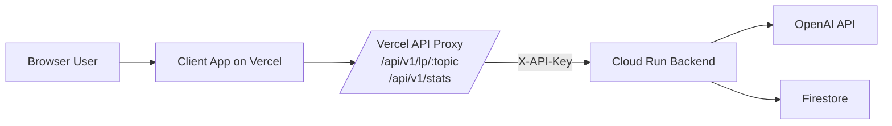
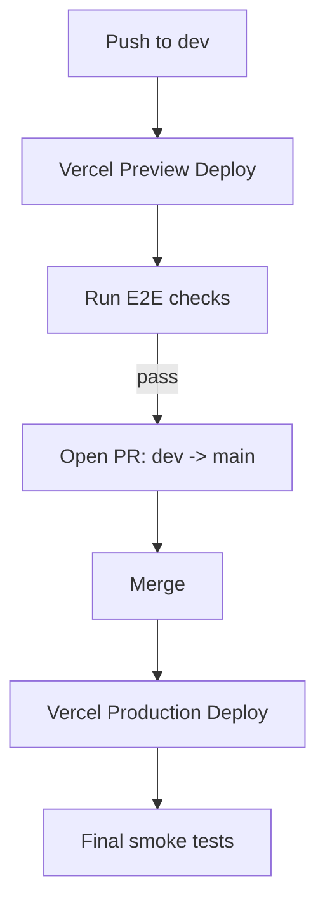

# Deployment Guide (E2E)

This document explains how to deploy and validate this project end-to-end with:

- **Server** on **Google Cloud Run**
- **Client** on **Vercel**
- **Trusted caller pattern** using Vercel server routes as a proxy to Cloud Run

It is intentionally educational: each section includes both **steps** and **why**.

---

## 1) Big Picture



### Why this shape matters

- Browser code is public, so secrets must stay out of it.
- Vercel API routes run server-side and can safely hold `BACKEND_API_KEY`.
- Cloud Run enforces `X-API-Key`, rate limit, and CORS.

---

## 2) Environment Variables Overview

### Server (Cloud Run)

- `OPENAI_API_KEY` (secret)
- `API_KEY` (required when auth enabled)
- `REQUIRE_API_KEY=true`
- `RATE_LIMIT_ENABLED=true`
- `LP_RATE_LIMIT=15/minute` (or your preferred value)
- `STATS_RATE_LIMIT=30/minute` (or your preferred value)
- `CORS_ORIGINS=<comma-separated frontend origins>`
- Firestore counter vars:
  - `COUNTER_BACKEND=firestore`
  - `FIRESTORE_COUNTER_COLLECTION=stats`
  - `FIRESTORE_COUNTER_DOCUMENT=learning_paths`
  - `FIRESTORE_COUNTER_FIELD=generated_count`

### Client (Vercel)

- Browser-visible:
  - `VITE_API_BASE_URL=/api`
- Server-only (Vercel functions):
  - `BACKEND_BASE_URL=https://<cloud-run-url>`
  - `BACKEND_API_KEY=<same value as Cloud Run API_KEY>`

---

## 3) Server Deployment (Cloud Run)

### Step A: Build image

```bash
gcloud builds submit --tag gcr.io/<your-gcp-project>/<your-cloud-run-service> ./server
```

### Step B: Deploy service

```bash
gcloud run deploy <your-cloud-run-service> \
  --project=<your-gcp-project> \
  --region=<your-region> \
  --platform=managed \
  --image=gcr.io/<your-gcp-project>/<your-cloud-run-service>
```

### Step C: Set/update runtime env

```bash
gcloud run services update <your-cloud-run-service> \
  --project=<your-gcp-project> \
  --region=<your-region> \
  --update-env-vars "^@^REQUIRE_API_KEY=true@RATE_LIMIT_ENABLED=true@LP_RATE_LIMIT=15/minute@STATS_RATE_LIMIT=30/minute@CORS_ORIGINS=https://<vercel-preview-domain>,https://<vercel-prod-domain>"
```

Set `API_KEY` and `OPENAI_API_KEY` via your preferred secure method (`--set-secrets` recommended).

### Why these steps matter

- New code does not apply until a new image is built + deployed.
- Env vars can exist in Cloud Run while old code ignores them (common pitfall).

---

## 4) Client Deployment (Vercel)

The frontend should call same-origin `/api/*`, not Cloud Run directly in browser code.

### Step A: Set Vercel env vars

For both **Preview** and **Production**:

- `VITE_API_BASE_URL=/api`
- `BACKEND_BASE_URL=https://<cloud-run-url>`
- `BACKEND_API_KEY=<same as Cloud Run API_KEY>`

### Step B: Deploy from branch

- `dev` branch -> Preview deployment
- `main` branch -> Production deployment

### Why these steps matter

- `VITE_*` is client-visible by design.
- `BACKEND_*` (non-`VITE_`) stays server-side in Vercel functions.
- This prevents exposing `X-API-Key` in browser traffic.

---

## 5) E2E Validation Checklist

### 5.1 Backend auth works

Unauthenticated call should fail:

```bash
curl -i "https://<cloud-run-url>/v1/stats"
```

Expected: `401`.

Authenticated call should pass:

```bash
curl -i -H "X-API-Key: <API_KEY>" "https://<cloud-run-url>/v1/stats"
```

Expected: `200`.

### 5.2 Proxy route works

```bash
curl -i "https://<vercel-preview-url>/api/v1/stats"
```

Expected: `200` (or backend error details), but **not 404**.

### 5.3 Browser flow works

- Open preview URL.
- Generate learning path.
- Confirm `/api/v1/lp/<topic>` and `/api/v1/stats` requests succeed.
- Confirm no CORS errors.

---

## 6) Promotion Flow (dev -> main)



### Recommended gate before merge

- Preview E2E passing
- Cloud Run auth/rate-limit validation passing
- No critical logs/errors in Cloud Run recent logs

---

## 7) Common Failure Modes and Fixes

### Issue: Cloud Run returns `200` without API key

Possible causes:
- Old image deployed (new auth code not live)
- Route not using auth dependency in current revision

Fix:
- Rebuild + redeploy backend image from latest commit
- Re-check latest Cloud Run revision and image

### Issue: Vercel `/api/v1/stats` returns `404`

Possible causes:
- `client/api/...` files not in deployed branch
- Preview not redeployed after adding API routes

Fix:
- Commit proxy files
- Redeploy preview

### Issue: Frontend says API base URL unset

Possible causes:
- `VITE_API_BASE_URL` missing at build time
- Wrong env scope (Preview vs Production)

Fix:
- Set `VITE_API_BASE_URL=/api` in correct environment
- Redeploy

### Issue: CORS error in browser

Possible causes:
- `CORS_ORIGINS` missing current Vercel domain
- Trailing slash mismatch in origin value

Fix:
- Update `CORS_ORIGINS` with exact origin(s), no trailing slash

---

## 8) Security Knowledge to Keep

- **API URL is not secret**; API keys and credentials are.
- **CORS is not auth**; it only governs browser origin behavior.
- **Frontend env vars are public** if bundled to client.
- **Server-side proxies (BFF)** are the minimum practical way to keep third-party or backend keys out of browser code.
- **Rate limiting + auth + monitoring** are baseline controls for public AI-backed endpoints.

---

## 9) Optional Next Improvements

- Move `API_KEY` to Secret Manager and inject with `--set-secrets`.
- Add request IDs and alerting on 401/429 spikes.
- Add bot protection (captcha/challenge) on generation endpoint.
- Rotate API key periodically.
