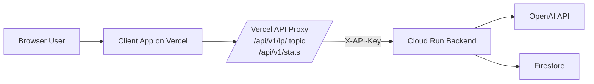
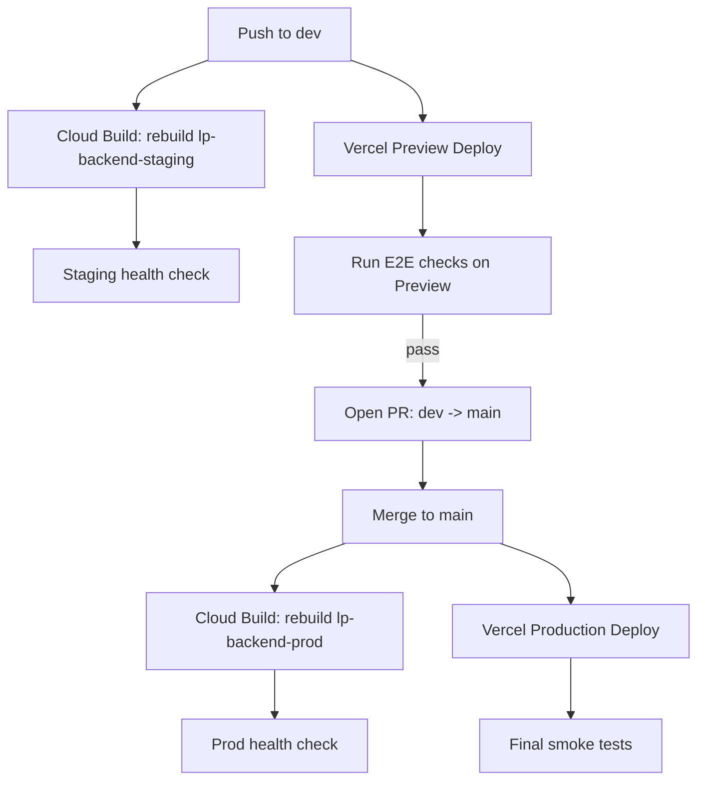

# Deployment Guide (E2E)

This document explains how to deploy and validate this project end-to-end with:

- **Server** on **Google Cloud Run**
- **Client** on **Vercel**
- **Trusted caller pattern** using Vercel server routes as a proxy to Cloud Run

It is intentionally educational: each section includes both **steps** and **why**.

---

## 1) Big Picture



### Why this shape matters

- Browser code is public, so secrets must stay out of it.
- Vercel API routes run server-side and can safely hold `BACKEND_API_KEY`.
- Cloud Run enforces `X-API-Key`, rate limit, and CORS.

---

## 2) Environment Variables Overview

### Server (Cloud Run)

- `OPENAI_API_KEY` (Secret Manager secret reference)
- `API_KEY` (Secret Manager secret reference; required when auth enabled)
- `REQUIRE_API_KEY=true`
- `RATE_LIMIT_ENABLED=true`
- `LP_RATE_LIMIT=15/minute` (or your preferred value)
- `STATS_RATE_LIMIT=30/minute` (or your preferred value)
- `CORS_ORIGINS=<comma-separated frontend origins>`
- Firestore counter vars:
  - `COUNTER_BACKEND=firestore`
  - `FIRESTORE_COUNTER_COLLECTION` — staging uses `stats-staging`, prod uses `stats` (separate data)
  - `FIRESTORE_COUNTER_DOCUMENT=learning_paths`
  - `FIRESTORE_COUNTER_FIELD=generated_count`

### Client (Vercel)

- Browser-visible:
  - `VITE_API_BASE_URL=/api`
- Server-only (Vercel functions):
  - `BACKEND_BASE_URL=https://<cloud-run-url>`
  - `BACKEND_API_KEY=<same value as Cloud Run API_KEY>`

---

## 3) Server Deployment (Cloud Run)

Backend deployments are **automated via Cloud Build triggers**. Pushing to `dev` or `main` rebuilds the image and deploys a new Cloud Run revision automatically.

| Trigger | Branch | Cloud Run Service | Config |
|---|---|---|---|
| `deploy-staging` | `dev` | `lp-backend-staging` | `server/cloudbuild.yaml` (default substitutions) |
| `deploy-prod` | `main` | `lp-backend-prod` | `server/cloudbuild.yaml` (`_SERVICE_NAME=lp-backend-prod`) |

Both triggers use the same `server/cloudbuild.yaml` with a `_SERVICE_NAME` substitution variable. The staging trigger uses the default (`lp-backend-staging`); the prod trigger overrides it to `lp-backend-prod`.

Both triggers have `includedFiles: server/**`, so they only fire when files under `server/` change. A push that only touches `client/` files will not trigger a backend rebuild.

### What the triggers do automatically

1. Build a Docker image from `server/`
2. Push it to Artifact Registry, tagged with both `$SHORT_SHA` (e.g. `:d1068c2`) and `:latest`
3. Deploy a new revision to the Cloud Run service (using the SHA-pinned image)

Env vars and Secret Manager references on each service **persist across revisions** — the triggers only rebuild the image and deploy.

### Manual steps (first-time setup or env changes only)

These are only needed when creating a new service or changing its configuration:

#### Set/update runtime env

```bash
gcloud run services update <your-cloud-run-service> \
  --project=<your-gcp-project> \
  --region=<your-region> \
  --update-env-vars "^@^REQUIRE_API_KEY=true@RATE_LIMIT_ENABLED=true@LP_RATE_LIMIT=15/minute@STATS_RATE_LIMIT=30/minute@CORS_ORIGINS=https://<vercel-preview-domain>,https://<vercel-prod-domain>"
```

#### Set/update secret references

```bash
gcloud run services update <your-cloud-run-service> \
  --project=<your-gcp-project> \
  --region=<your-region> \
  --set-secrets "OPENAI_API_KEY=OPENAI_API_KEY:latest,API_KEY=API_KEY:latest"
```

Both backend secrets should be consumed through Secret Manager references on Cloud Run (not plaintext env values).

### Cloud Build IAM prerequisites

The Cloud Build service account needs these roles (already granted):

```bash
# Allow Cloud Build to deploy to Cloud Run
gcloud projects add-iam-policy-binding <project> \
  --member="serviceAccount:<project-number>@cloudbuild.gserviceaccount.com" \
  --role="roles/run.admin"

# Allow Cloud Build to act as the compute service account
gcloud iam service-accounts add-iam-policy-binding \
  <project-number>-compute@developer.gserviceaccount.com \
  --member="serviceAccount:<project-number>@cloudbuild.gserviceaccount.com" \
  --role="roles/iam.serviceAccountUser"
```

### Artifact Registry cleanup

The `lp-backend` Artifact Registry repo has two policies: `keep-last-10` (retain 10 most recent versions) and `delete-old-untagged` (delete untagged images older than 7 days).

### Rollback

To roll back to a previous revision, deploy a known-good SHA-tagged image:

```bash
gcloud run deploy <service> --image=<ar-url>:<old-sha> --region=northamerica-northeast2
```

Example: `gcloud run deploy lp-backend-prod --image=northamerica-northeast2-docker.pkg.dev/learn-anything-487522/lp-backend/lp-backend-prod:d1068c2 --region=northamerica-northeast2`

### Why these steps matter

- New code does not apply until a new image is built + deployed. Cloud Build triggers handle this automatically on push.
- Env vars and secrets are set once on the Cloud Run service and persist — you don't re-set them on every deploy.

---

## 4) Client Deployment (Vercel)

The frontend should call same-origin `/api/*`, not Cloud Run directly in browser code.

### Step A: Set Vercel env vars

For both **Preview** and **Production**:

- `VITE_API_BASE_URL=/api`
- `BACKEND_BASE_URL=https://<cloud-run-url>`
- `BACKEND_API_KEY=<same as Cloud Run API_KEY>`

### Step B: Deploy from branch

- `dev` branch -> Preview deployment
- `main` branch -> Production deployment

### Why these steps matter

- `VITE_*` is client-visible by design.
- `BACKEND_*` (non-`VITE_`) stays server-side in Vercel functions.
- This prevents exposing `X-API-Key` in browser traffic.

---

## 5) E2E Validation Checklist

### 5.1 Backend auth works

Unauthenticated call should fail:

```bash
curl -i "https://<cloud-run-url>/v1/stats"
```

Expected: `401`.

Authenticated call should pass:

```bash
curl -i -H "X-API-Key: <API_KEY>" "https://<cloud-run-url>/v1/stats"
```

Expected: `200`.

### 5.2 Proxy route works

```bash
curl -i "https://<vercel-preview-url>/api/v1/stats"
```

Expected: `200` (or backend error details), but **not 404**.

### 5.3 Browser flow works

- Open preview URL.
- Generate learning path.
- Confirm `/api/v1/lp/<topic>` and `/api/v1/stats` requests succeed.
- Confirm no CORS errors.

### 5.4 Learning path error mapping looks correct

The learning path service raises a single request-safe error type, and the route translates it directly by status code. Quick checks:

- Overlong topic (more than 120 chars) should return `400`.
- Upstream rate-limit scenarios should return `429`.
- Upstream connectivity/outage scenarios should return `503`.

---

## 6) Promotion Flow (dev -> main)



Both backend and frontend deployments are now automated:

- **Push to `dev`** triggers Cloud Build (`deploy-staging`) + Vercel Preview in parallel
- **Merge to `main`** triggers Cloud Build (`deploy-prod`) + Vercel Production in parallel

### Recommended gate before merge

- Preview E2E passing
- Staging Cloud Run health check passing
- No critical logs/errors in Cloud Run recent logs

### Production deployment best practice

- Staging and production are separate Cloud Run services (`lp-backend-staging` and `lp-backend-prod`).
- Merging `dev -> main` automatically deploys a new revision to `lp-backend-prod` via Cloud Build.
- Vercel Production `BACKEND_BASE_URL` points to the production Cloud Run URL only.

---

## 7) Common Failure Modes and Fixes

### Issue: Cloud Run returns `200` without API key

Possible causes:
- Old image deployed (new auth code not live)
- Route not using auth dependency in current revision

Fix:
- Rebuild + redeploy backend image from latest commit
- Re-check latest Cloud Run revision and image

### Issue: Vercel `/api/v1/stats` returns `404`

Possible causes:
- `client/api/...` files not in deployed branch
- Preview not redeployed after adding API routes

Fix:
- Commit proxy files
- Redeploy preview

### Issue: Frontend says API base URL unset

Possible causes:
- `VITE_API_BASE_URL` missing at build time
- Wrong env scope (Preview vs Production)

Fix:
- Set `VITE_API_BASE_URL=/api` in correct environment
- Redeploy

### Issue: CORS error in browser

Possible causes:
- `CORS_ORIGINS` missing current Vercel domain
- Trailing slash mismatch in origin value

Fix:
- Update `CORS_ORIGINS` with exact origin(s), no trailing slash

---

## 8) Security Knowledge to Keep

- **API URL is not secret**; API keys and credentials are.
- **CORS is not auth**; it only governs browser origin behavior.
- **Frontend env vars are public** if bundled to client.
- **Server-side proxies (BFF)** are the minimum practical way to keep third-party or backend keys out of browser code.
- **Rate limiting + auth + monitoring** are baseline controls for public AI-backed endpoints.

---

## 9) Optional Next Improvements

- Add request IDs and alerting on 401/429 spikes.
- Add bot protection (captcha/challenge) on generation endpoint.
- Rotate API key periodically.
