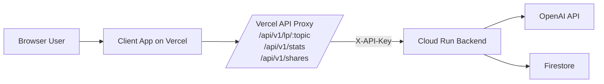
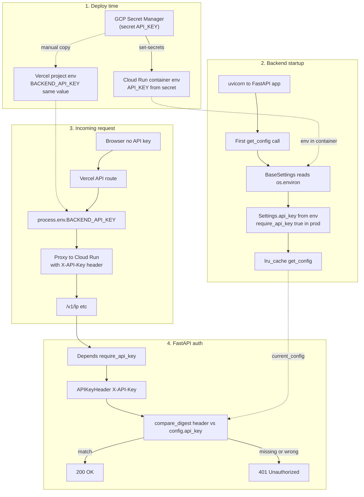
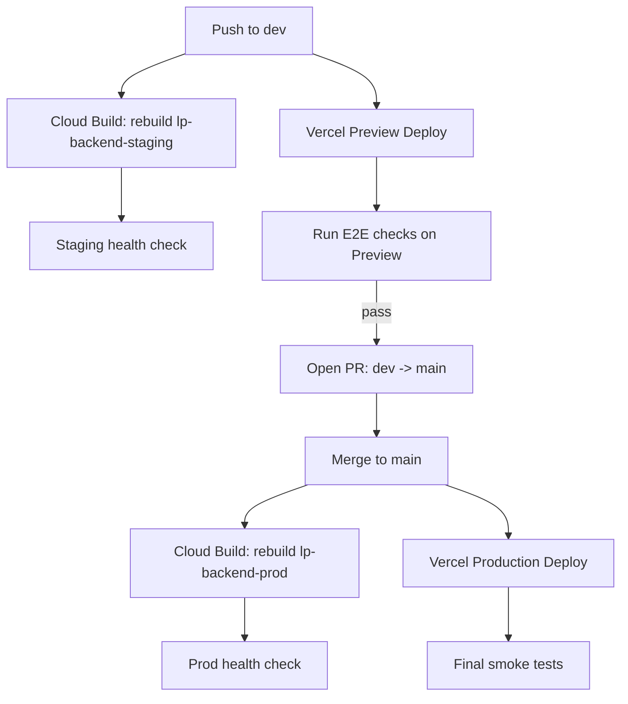

# Deployment Guide (E2E)

This document explains how to deploy and validate this project end-to-end with:

- **Server** on **Google Cloud Run**
- **Client** on **Vercel**
- **Trusted caller pattern** using Vercel server routes as a proxy to Cloud Run

It is intentionally educational: each section includes both **steps** and **why**.

---

## 1) Big Picture


```mermaid
flowchart LR
    U[Browser User] --> V[Client App on Vercel]
    V --> VP[/Vercel API Proxy<br/>/api/v1/lp/:topic<br/>/api/v1/stats<br/>/api/v1/shares/]
    VP -->|X-API-Key| CR[Cloud Run Backend]
    CR --> OAI[OpenAI API]
    CR --> FS[Firestore]
```

### Why this shape matters

- Browser code is public, so secrets must stay out of it.
- Vercel API routes run server-side and can safely hold `BACKEND_API_KEY`.
- Cloud Run enforces `X-API-Key`, rate limit, and CORS.

---

## 2) Environment Variables Overview

### Server (Cloud Run)

- `OPENAI_API_KEY` (Secret Manager secret reference)
- `OPENAI_MODEL=gpt-6-luna` (learning-path generation; an existing value overrides the code default)
- `API_KEY` (Secret Manager secret reference; required when auth enabled)
- `REQUIRE_API_KEY=true`
- `RATE_LIMIT_ENABLED=true`
- `LP_RATE_LIMIT=15/minute` (or your preferred value)
- `STATS_RATE_LIMIT=30/minute` (or your preferred value)
- `SHARE_RATE_LIMIT=5/minute` (creation limit; reads are not rate limited in v1)
- `CORS_ORIGINS=<comma-separated frontend origins>`
- Firestore counter vars:
  - `COUNTER_BACKEND=firestore`
  - `FIRESTORE_COUNTER_COLLECTION` — staging uses `stats-staging`, prod uses `stats` (separate data)
  - `FIRESTORE_COUNTER_DOCUMENT=learning_paths`
  - `FIRESTORE_COUNTER_FIELD=generated_count`
- Firestore cache vars (learning path caching — skips OpenAI for repeat topics):
  - `CACHE_BACKEND=firestore` (set to `noop` to disable)
  - `FIRESTORE_CACHE_COLLECTION` — staging uses `learning_path_cache_staging`, prod uses `learning_path_cache`
  - `CACHE_TTL_SECONDS=604800` (7 days; tune as needed)
- Firestore immutable share vars:
  - `SHARE_BACKEND=firestore` (set to `noop` to disable sharing with `503` responses)
  - `FIRESTORE_SHARE_COLLECTION` — use separate staging and production collections, such as `learning_path_shares_staging` and `learning_path_shares`
  - Exact snapshot retries reuse the same content-addressed share ID; any change to the path data or default view creates a different immutable URL.

### Client (Vercel)

- Browser-visible:
  - `VITE_API_BASE_URL=/api`
  - `VITE_SITE_URL=https://<canonical-domain>` — used by SEO components for canonical URLs, OpenGraph, and JSON-LD. Falls back to the production URL if unset.
- Server-only (Vercel functions):
  - `BACKEND_BASE_URL=https://<cloud-run-url>`
  - `BACKEND_API_KEY=<same value as Cloud Run API_KEY>`

### API key lifecycle (production)


```mermaid
flowchart TB
    subgraph Deploy["1. Deploy time"]
        SM["GCP Secret Manager\n(secret API_KEY)"]
        CR_env["Cloud Run container env\nAPI_KEY from secret"]
        V_env["Vercel project env\nBACKEND_API_KEY same value"]
        SM -->|set-secrets| CR_env
        SM -.->|manual copy| V_env
    end

    subgraph Startup["2. Backend startup"]
        Uvicorn["uvicorn to FastAPI app"]
        First_call["First get_config call"]
        PS["BaseSettings reads os.environ"]
        Settings["Settings.api_key from env\nrequire_api_key true in prod"]
        Cache["lru_cache get_config"]
        Uvicorn --> First_call
        First_call --> PS
        PS --> Settings
        Settings --> Cache
        CR_env -.->|env in container| PS
    end

    subgraph Request["3. Incoming request"]
        Browser["Browser no API key"]
        Vercel["Vercel API route"]
        Vercel_read["process.env.BACKEND_API_KEY"]
        Proxy["Proxy to Cloud Run\nwith X-API-Key header"]
        Browser --> Vercel
        V_env -.-> Vercel_read
        Vercel --> Vercel_read
        Vercel_read --> Proxy
        Proxy --> Backend
    end

    subgraph Auth["4. FastAPI auth"]
        Backend["/v1/lp etc"]
        Dep["Depends require_api_key"]
        Header["APIKeyHeader X-API-Key"]
        Check["compare_digest header vs config.api_key"]
        OK["200 OK"]
        Fail["401 Unauthorized"]
        Backend --> Dep
        Dep --> Header
        Header --> Check
        Check -->|match| OK
        Check -->|missing or wrong| Fail
        Cache -.->|current_config| Check
    end

    Deploy ~~~ Startup
    Startup ~~~ Request
    Request ~~~ Auth
```

---

## 3) Server Deployment (Cloud Run)

Backend deployments are **automated via Cloud Build triggers**. Pushing to `dev` or `main` rebuilds the image and deploys a new Cloud Run revision automatically.

| Trigger | Branch | Cloud Run Service | Config |
|---|---|---|---|
| `deploy-staging` | `dev` | `lp-backend-staging` | `server/cloudbuild.yaml` (default substitutions) |
| `deploy-prod` | `main` | `lp-backend-prod` | `server/cloudbuild.yaml` (`_SERVICE_NAME=lp-backend-prod`) |

Both triggers use the same `server/cloudbuild.yaml` with a `_SERVICE_NAME` substitution variable. The staging trigger uses the default (`lp-backend-staging`); the prod trigger overrides it to `lp-backend-prod`.

Both triggers have `includedFiles: server/**`, so they only fire when files under `server/` change. A push that only touches `client/` files will not trigger a backend rebuild.

### What the triggers do automatically

1. Build a Docker image from `server/`
2. Push it to Artifact Registry, tagged with both `$SHORT_SHA` (e.g. `:d1068c2`) and `:latest`
3. Deploy a new revision to the Cloud Run service (using the SHA-pinned image)

Env vars and Secret Manager references on each service **persist across revisions** — the triggers only rebuild the image and deploy.

### GPT-6 Luna rollout

The generation default is `gpt-6-luna`, using Responses structured outputs with
`reasoning.effort=none` to preserve the previous non-reasoning workload. Moderation
continues through the existing Moderations API; it does not use the generation model.
The prompt, graph schema, and `store=True` behavior are unchanged. See the
[official model page](https://developers.openai.com/api/docs/models/gpt-6-luna) and
[migration guide](https://developers.openai.com/api/docs/guides/latest-model/gpt-6-astra#migration-quickstart).

Before an authorized rollout, inspect `OPENAI_MODEL` on staging and production.
An old override persists through image deployments: set it to `gpt-6-luna` or remove
it to use the new code default. Likewise, update any local `server/.env` override
manually; copying the new example does not modify an existing environment file.

The learning-path cache is keyed by topic, not model. Existing cached paths can
still report the previous model until their TTL expires (default seven days).
For an immediate cutover, use a fresh `FIRESTORE_CACHE_COLLECTION` per environment
when deploying; retain the old collection for rollback instead of deleting data.
Existing immutable shares and curated paths remain historical snapshots.

Validate model access and representative generation quality, latency, and usage
in staging before production promotion. Mocked tests verify request compatibility,
not live account access or model output quality. Deploying and changing service
environment variables are separate runtime actions from preparing this PR.

### Manual steps (first-time setup or env changes only)

These are only needed when creating a new service or changing its configuration:

#### Set/update runtime env

```bash
gcloud run services update <your-cloud-run-service> \
  --project=<your-gcp-project> \
  --region=<your-region> \
  --update-env-vars "^@^REQUIRE_API_KEY=true@RATE_LIMIT_ENABLED=true@LP_RATE_LIMIT=15/minute@STATS_RATE_LIMIT=30/minute@SHARE_RATE_LIMIT=5/minute@CACHE_BACKEND=firestore@CACHE_TTL_SECONDS=604800@SHARE_BACKEND=firestore@FIRESTORE_SHARE_COLLECTION=learning_path_shares@CORS_ORIGINS=https://<vercel-preview-domain>,https://<vercel-prod-domain>"
```

#### Set/update secret references

```bash
gcloud run services update <your-cloud-run-service> \
  --project=<your-gcp-project> \
  --region=<your-region> \
  --set-secrets "OPENAI_API_KEY=OPENAI_API_KEY:latest,API_KEY=API_KEY:latest"
```

Both backend secrets should be consumed through Secret Manager references on Cloud Run (not plaintext env values).

### Cloud Build IAM prerequisites

The Cloud Build service account needs these roles (already granted):

```bash
# Allow Cloud Build to deploy to Cloud Run
gcloud projects add-iam-policy-binding <project> \
  --member="serviceAccount:<project-number>@cloudbuild.gserviceaccount.com" \
  --role="roles/run.admin"

# Allow Cloud Build to act as the compute service account
gcloud iam service-accounts add-iam-policy-binding \
  <project-number>-compute@developer.gserviceaccount.com \
  --member="serviceAccount:<project-number>@cloudbuild.gserviceaccount.com" \
  --role="roles/iam.serviceAccountUser"
```

### Artifact Registry cleanup

The `lp-backend` Artifact Registry repo has two policies: `keep-last-10` (retain 10 most recent versions) and `delete-old-untagged` (delete untagged images older than 7 days).

### Rollback

To roll back to a previous revision, deploy a known-good SHA-tagged image:

```bash
gcloud run deploy <service> --image=<ar-url>:<old-sha> --region=northamerica-northeast2
```

Example: `gcloud run deploy lp-backend-prod --image=northamerica-northeast2-docker.pkg.dev/learn-anything-487522/lp-backend/lp-backend-prod:d1068c2 --region=northamerica-northeast2`

### Why these steps matter

- New code does not apply until a new image is built + deployed. Cloud Build triggers handle this automatically on push.
- Env vars and secrets are set once on the Cloud Run service and persist — you don't re-set them on every deploy.

---

## 4) Client Deployment (Vercel)

The frontend should call same-origin `/api/*`, not Cloud Run directly in browser code.

### Step A: Set Vercel env vars

For both **Preview** and **Production**:

- `VITE_API_BASE_URL=/api`
- `BACKEND_BASE_URL=https://<cloud-run-url>`
- `BACKEND_API_KEY=<same as Cloud Run API_KEY>`

### Step B: Deploy from branch

- `dev` branch -> Preview deployment
- `main` branch -> Production deployment

### Why these steps matter

- `VITE_*` is client-visible by design.
- `BACKEND_*` (non-`VITE_`) stays server-side in Vercel functions.
- This prevents exposing `X-API-Key` in browser traffic.

---

## 5) E2E Validation Checklist

### 5.1 Backend auth works

Unauthenticated call should fail:

```bash
curl -i "https://<cloud-run-url>/v1/stats"
```

Expected: `401`.

Authenticated call should pass:

```bash
curl -i -H "X-API-Key: <API_KEY>" "https://<cloud-run-url>/v1/stats"
```

Expected: `200`.

### 5.2 Proxy route works

```bash
curl -i "https://<vercel-preview-url>/api/v1/stats"
```

Expected: `200` (or backend error details), but **not 404**.

### 5.3 Browser flow works

- Open preview URL.
- Generate learning path.
- Confirm `/api/v1/lp/<topic>` and `/api/v1/stats` requests succeed.
- Confirm no CORS errors.

### 5.4 SEO signals are present

Static crawl files are accessible at the domain root:

```bash
curl -s "https://<vercel-url>/robots.txt" | head -5
curl -s "https://<vercel-url>/sitemap.xml"
curl -s "https://<vercel-url>/llms.txt" | head -3
```

Pre-rendered HTML contains SEO tags (visible without JS):

```bash
# View source — should contain complete visible content plus unique metadata and JSON-LD
curl -s "https://<vercel-url>/" | grep -E '<title>|og:title|application/ld\+json'
curl -s "https://<vercel-url>/about" | grep -E '<title>|og:title|application/ld\+json'
curl -s "https://<vercel-url>/topics" | grep -E '<h1>|/learn/javascript'
curl -s "https://<vercel-url>/learn/javascript" | grep -E '<h1>|LearningResource|BreadcrumbList'
```

In-browser checks (with JS running):

- Home (`/`): title is "LearnAnything" and featured paths are ordinary links
- Topics (`/topics`): all 24 reviewed paths are visible as ordinary links
- Learning path (`/learningpath?term=React`): `<meta name="robots">` is `noindex,follow`
- Shared path (`/share/<id>`): both the HTML metadata and `X-Robots-Tag` are `noindex,nofollow`
- Unknown `/learn/*` slug: response status is `404`
- 404 page: `<meta name="robots">` is `noindex,follow`

Validate structured data at [Google Rich Results Test](https://search.google.com/test/rich-results) and [Schema.org Validator](https://validator.schema.org/).

Before production release, record Search Console baselines for manual actions, indexed pages,
crawl errors, impressions, clicks, and affected queries. Submit the regenerated sitemap after
deployment, then compare indexing at 2, 4, and 8 weeks. Ranking recovery is a monitored outcome,
not a release acceptance guarantee.

### 5.5 Learning path caching works (if `CACHE_BACKEND=firestore`)

```bash
# First request — should return cached: false
curl -s -H "X-API-Key: <API_KEY>" "https://<cloud-run-url>/v1/lp/React" | jq '.cached'
# Expected: false

# Second request (same topic) — should return cached: true
curl -s -H "X-API-Key: <API_KEY>" "https://<cloud-run-url>/v1/lp/React" | jq '.cached'
# Expected: true
```

If `CACHE_BACKEND=noop`, both requests return `cached: false` (caching disabled).

### 5.6 Learning path error mapping looks correct

The learning path service raises a single request-safe error type, and the route translates it directly by status code. Quick checks:

- Overlong topic (more than 120 chars) should return `400`.
- Upstream rate-limit scenarios should return `429`.
- Upstream connectivity/outage scenarios should return `503`.

---

## 6) Promotion Flow (dev -> main)


```mermaid
flowchart TD
    D[Push to dev] --> CB_S[Cloud Build: rebuild lp-backend-staging]
    D --> PV[Vercel Preview Deploy]
    CB_S --> HEALTH_S[Staging health check]
    PV --> T[Run E2E checks on Preview]
    T -->|pass| PR[Open PR: dev -> main]
    PR --> M[Merge to main]
    M --> CB_P[Cloud Build: rebuild lp-backend-prod]
    M --> PD[Vercel Production Deploy]
    CB_P --> HEALTH_P[Prod health check]
    PD --> V[Final smoke tests]
```

Both backend and frontend deployments are now automated:

- **Push to `dev`** triggers Cloud Build (`deploy-staging`) + Vercel Preview in parallel
- **Merge to `main`** triggers Cloud Build (`deploy-prod`) + Vercel Production in parallel

### Recommended gate before merge

- Preview E2E passing
- Staging Cloud Run health check passing
- No critical logs/errors in Cloud Run recent logs

### Production deployment best practice

- Staging and production are separate Cloud Run services (`lp-backend-staging` and `lp-backend-prod`).
- Merging `dev -> main` automatically deploys a new revision to `lp-backend-prod` via Cloud Build.
- Vercel Production `BACKEND_BASE_URL` points to the production Cloud Run URL only.

---

## 7) Post-Deploy: SEO Submissions (Production Only)

After the first production deploy with SEO changes:

1. **Google Search Console** — submit `https://www.learn-anything.ca/sitemap.xml`
2. **Bing Webmaster Tools** — submit the same sitemap
3. **Google Rich Results Test** — test `/` and `/about` live to confirm structured data is valid

These are one-time steps. Subsequent deploys don't need re-submission unless the sitemap URL changes.

---

## 8) Common Failure Modes and Fixes

### Issue: Cloud Run returns `200` without API key

Possible causes:
- Old image deployed (new auth code not live)
- Route not using auth dependency in current revision

Fix:
- Rebuild + redeploy backend image from latest commit
- Re-check latest Cloud Run revision and image

### Issue: Vercel `/api/v1/stats` returns `404`

Possible causes:
- `client/api/...` files not in deployed branch
- Preview not redeployed after adding API routes

Fix:
- Commit proxy files
- Redeploy preview

### Issue: Frontend says API base URL unset

Possible causes:
- `VITE_API_BASE_URL` missing at build time
- Wrong env scope (Preview vs Production)

Fix:
- Set `VITE_API_BASE_URL=/api` in correct environment
- Redeploy

### Issue: CORS error in browser

Possible causes:
- `CORS_ORIGINS` missing current Vercel domain
- Trailing slash mismatch in origin value

Fix:
- Update `CORS_ORIGINS` with exact origin(s), no trailing slash

---

## 9) Security Knowledge to Keep

- **API URL is not secret**; API keys and credentials are.
- **CORS is not auth**; it only governs browser origin behavior.
- **Frontend env vars are public** if bundled to client.
- **Server-side proxies (BFF)** are the minimum practical way to keep third-party or backend keys out of browser code.
- **Rate limiting + auth + monitoring** are baseline controls for public AI-backed endpoints.

---

## 10) Optional Next Improvements

- Add request IDs and alerting on 401/429 spikes.
- Add bot protection (captcha/challenge) on generation endpoint.
- Rotate API key periodically.
