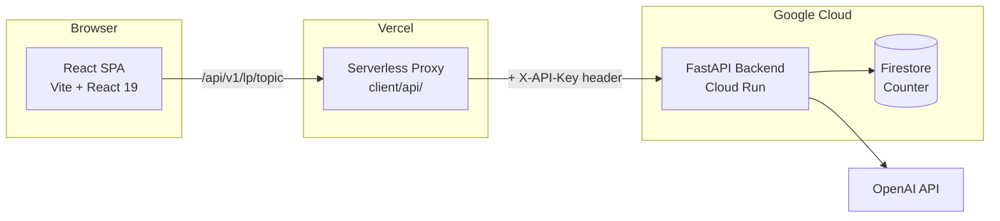
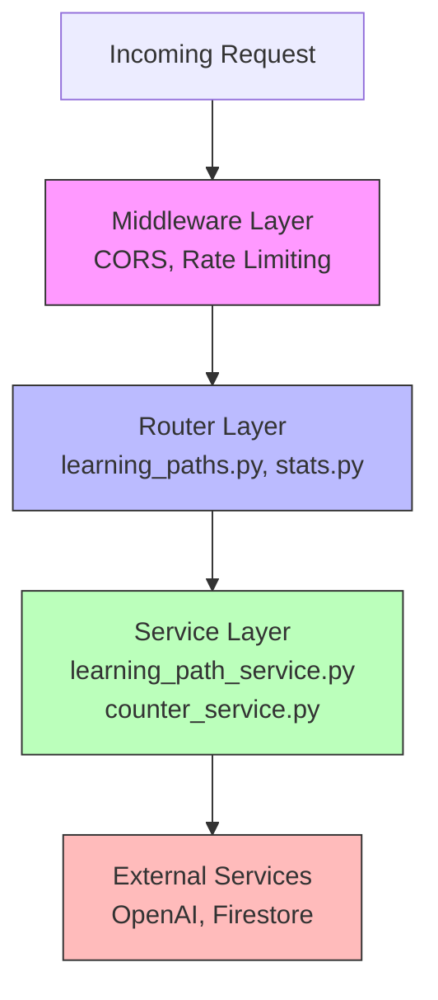
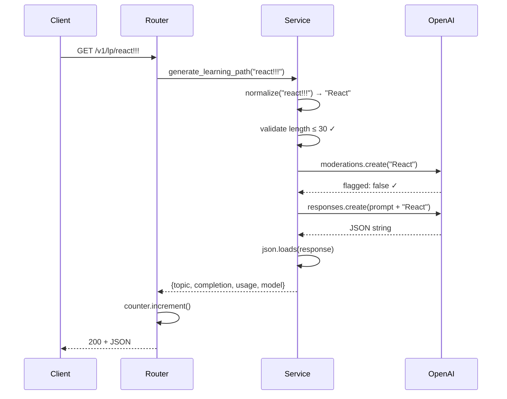
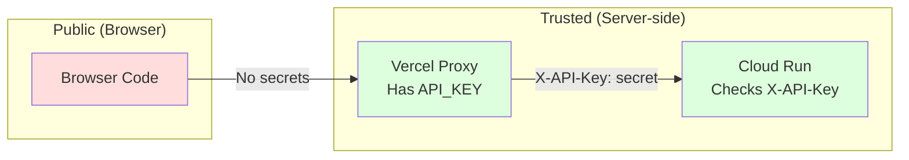
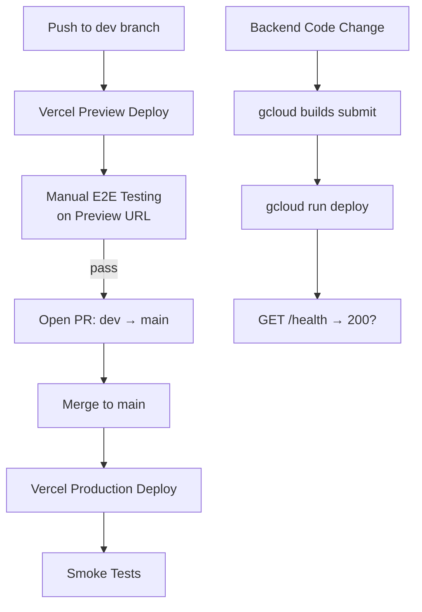

# LEARN.md — Learning Path Generator

Welcome to the behind-the-scenes tour of LearnAnything. This document explains how the whole thing works, why we made the decisions we did, and what you can learn from building it.

---

## What Does This App Actually Do?

You type a topic — say, "React" or "How to cook" — and the app generates a structured learning path broken into Beginner, Intermediate, and Advanced concepts. You can drag-and-drop the items to reorder them, then copy the result to your clipboard.

Think of it like asking a knowledgeable tutor: "If I wanted to learn X from scratch, what concepts should I study, and in what order?"

Under the hood, a React frontend sends your topic to a FastAPI backend, which calls OpenAI's GPT API with a carefully crafted prompt, parses the JSON response, and sends it back. There's also a generation counter (tracked in Firestore) so the homepage can show how many paths have been created.

---

## Technical Architecture

### The Big Picture



**In local dev**, the React app talks directly to the FastAPI server at `localhost:8000`. No proxy needed.

**In production**, the browser never talks to Cloud Run directly. Instead, requests go to Vercel's serverless functions (`/api/*`), which inject the secret API key and forward the request. This is the classic **Backend-for-Frontend (BFF)** pattern.

### Why This Shape?

Imagine you're building a house. You wouldn't put the vault combination on the front door — you'd put it in a locked room that only authorized people can access. That's exactly what the proxy layer does: it keeps the `API_KEY` in a "locked room" (server-side Vercel functions) instead of shipping it to every browser.

---

## Codebase Structure

```
lp-generator/
├── client/                    # React frontend
│   ├── api/                   # Vercel serverless proxy routes
│   │   └── v1/
│   │       ├── lp/[topic].js  # Proxies learning path requests
│   │       └── stats.js       # Proxies stats requests
│   ├── src/
│   │   ├── App.jsx            # Route wiring + SnackbarProvider
│   │   ├── config/api.js      # API base URL resolution
│   │   ├── components/        # Reusable UI (NavBar, Searchbar, Button)
│   │   ├── pages/
│   │   │   ├── HomePage/      # Search + recommended topics + counter
│   │   │   ├── LearningPath/  # Main feature: renders + drag-and-drop
│   │   │   ├── AboutPage/     # Static about page
│   │   │   ├── LoadingSpinner/
│   │   │   └── 404/
│   │   └── util/pages.jsx     # Route registry (main + hidden pages)
│   └── package.json
│
├── server/                    # Python backend
│   ├── app/
│   │   ├── main.py            # FastAPI app wiring
│   │   ├── api/router.py      # Route aggregation under /v1
│   │   ├── routers/
│   │   │   ├── learning_paths.py  # GET /v1/lp/{topic}
│   │   │   └── stats.py          # GET /v1/stats
│   │   ├── services/
│   │   │   ├── learning_path_service.py  # OpenAI prompt + parse
│   │   │   └── counter_service.py        # Noop or Firestore counter
│   │   ├── schemas/           # Pydantic response models
│   │   ├── core/
│   │   │   ├── config.py      # Settings from env vars
│   │   │   ├── security.py    # API key auth + rate limiter
│   │   │   └── dependencies.py # FastAPI DI wiring
│   │   └── __init__.py
│   ├── tests/
│   ├── Makefile               # format, lint, test, check
│   └── pyproject.toml
│
└── docker-compose.yml         # Full-stack local run
```

---

## How the Backend Works

### The Layered Architecture

The backend follows a clean layered pattern that you'll see in most well-structured APIs:



Each layer has a single responsibility:

1. **Middleware** (in `main.py`): CORS headers, rate limiting via `slowapi`. This runs on every request before it even hits a route.

2. **Routers** (in `routers/`): Handle HTTP concerns — status codes, error mapping, request parsing. They translate between "HTTP world" and "business logic world."

3. **Services** (in `services/`): Pure business logic. `LearningPathService` knows how to call OpenAI and parse responses. `BaseCounterService` knows how to count things. Neither knows about HTTP.

4. **External services**: OpenAI API, Firestore. The services talk to these, not the routers.

### Why Layers Matter

Think of it like a restaurant. The waiter (router) takes your order, translates it for the kitchen (service), and brings back the food plated nicely (HTTP response). The waiter doesn't cook, and the chef doesn't seat customers. If you swap the oven (OpenAI → another AI), only the kitchen changes — the waiter and customers don't notice.

### The Prompt Engineering

The heart of the app lives in `learning_path_service.py`. The system prompt instructs GPT to:
1. Generate key concepts for a topic
2. Rank them from easiest to hardest
3. Group them as Beginner / Intermediate / Advanced
4. Output the result as JSON

The prompt includes an example output for "JavaScript" — this is called **few-shot prompting**. By showing the model one concrete example, you dramatically improve the consistency and structure of its output.

### The Generation Pipeline

When someone requests a learning path for "react!!!", here's what happens step by step:



Notice the three safety checks before the actual generation:
1. **Normalize** — strips punctuation, title-cases (`react!!!` → `React`)
2. **Validate length** — rejects anything over 30 characters
3. **Content moderation** — uses OpenAI's moderation API to flag inappropriate topics *before* spending tokens on generation

This is a great pattern: **fail fast and cheaply**. A moderation check is much cheaper than a full GPT call, so we do it first.

### Dependency Injection

The backend uses FastAPI's `Depends()` system to wire things together. Look at `dependencies.py`:

```python
def get_learning_path_service() -> LearningPathService:
    config = get_config()
    return LearningPathService(
        client=get_openai_client(config),
        model=config.openai_model,
        max_topic_length=config.max_topic_length,
    )
```

The router never creates an `OpenAI` client or reads config directly. It just declares what it needs via `Depends(get_learning_path_service)`, and FastAPI provides it. This makes testing trivial — in tests, you swap the real dependency with a mock:

```python
app.dependency_overrides[get_learning_path_service] = lambda: mock_svc
```

No monkey-patching, no special test modes — just clean dependency replacement.

### The Counter Service: Strategy Pattern in Action

The counter system uses a classic design pattern. `BaseCounterService` defines the interface (increment, get count). Two implementations exist:

- **`NoopCounterService`** — returns a hardcoded seed number, doesn't actually count. Used locally.
- **`FirestoreCounterService`** — reads/writes a Firestore document. Used in production.

Which one gets used is decided at startup based on `COUNTER_BACKEND=noop|firestore`. If Firestore is configured but unavailable, it gracefully falls back to noop with a warning. The router and frontend never know or care which implementation is running.

---

## How the Frontend Works

### Routing

The app uses `react-router-dom` with a centralized route registry in `util/pages.jsx`:

```javascript
export const pages = {
  404: { component: Page404 },
  main: [
    { label: "Home", component: HomePage, path: "/" },
    { label: "About", component: AboutPage, path: "/about" },
  ],
  hidden: [
    { label: "Learning Path", component: LearningPath, path: "/learningpath" },
  ],
};
```

**`main`** routes show up in the NavBar. **`hidden`** routes exist but aren't linked from the nav — the learning path page is navigated to programmatically when you search. This is a clean pattern: adding a new page means adding one entry here, and both the router and the navbar update automatically.

### The Searchbar Experience

The homepage searchbar has a delightful touch: the placeholder text cycles through random topic suggestions every 3 seconds with a fade transition. Below the search, 5 random "Recommended" topics are shown as clickable chips.

When you hit Enter or click "Generate", the app navigates to `/learningpath?term=React` — the topic lives in the URL query parameter, not in component state. This means you can share a learning path URL and the recipient sees the same result. URL-driven state is a simple but powerful pattern.

### Drag-and-Drop

The learning path results page uses `@dnd-kit` for drag-and-drop. Each difficulty level (Beginner, Intermediate, Advanced) is a **droppable container**, and each concept within it is a **sortable item**. You can:

- Reorder items within a level (e.g., move "JSX" above "Components" in Beginner)
- Move items between levels (e.g., drag a topic from Intermediate down to Advanced)

The DnD implementation handles three events:
- `onDragStart` — tracks which item is being dragged
- `onDragOver` — handles cross-container movement (the tricky part)
- `onDragEnd` — handles same-container reordering

After rearranging, the "copy to clipboard" button exports the current state as indented text — perfect for pasting into your own notes.

### API URL Resolution

`config/api.js` handles a subtle problem: the same React code needs to call different URLs in dev vs. prod.

- **Dev**: calls `http://localhost:8000` directly (the FastAPI server)
- **Prod**: calls `/api` (same-origin Vercel proxy)

The `VITE_API_BASE_URL` env var controls this, with smart fallbacks. The `apiUrl("/v1/lp/topic")` helper normalizes paths so you never get double slashes or trailing slashes — a common source of 404s.

---

## The Security Model

### The "Trusted Caller" Pattern



The backend requires an `X-API-Key` header on all requests (when `REQUIRE_API_KEY=true`, which is the default in production). The Vercel proxy functions inject this header server-side. The browser never sees the API key.

### Defense in Depth

The backend layers multiple protections:

1. **API key authentication** — rejects requests without a valid `X-API-Key`
2. **Rate limiting** — `slowapi` limits requests per IP (15/min for generation, 30/min for stats)
3. **CORS** — restricts which origins can make requests (wildcard blocked in production)
4. **Input validation** — topic length capped at 30 characters
5. **Content moderation** — OpenAI's moderation API screens topics before generation

Each layer catches a different class of abuse. Rate limiting stops automated scraping. Auth stops unauthorized access. Moderation stops inappropriate content. They work together like layers of an onion.

### Secrets Management

A clear rule: anything starting with `VITE_` gets bundled into the client JavaScript and is visible to anyone. That's by design — Vite explicitly marks these as public. So `VITE_API_BASE_URL=/api` is fine (it's just a path), but you'd never put `VITE_API_KEY=secret` (it would be exposed).

Server-only secrets (`BACKEND_API_KEY`, `OPENAI_API_KEY`) live in Vercel environment variables (for the proxy) and Cloud Run secrets (for the backend). They never appear in browser-accessible code.

---

## The Testing Strategy

### Backend Tests

Tests live in `server/tests/` and use `pytest` with FastAPI's `TestClient`. The setup is clean:

- `conftest.py` sets `APP_ENV=test` so the config auto-fills test values (no real OpenAI key needed)
- Router tests use `app.dependency_overrides` to inject mock services
- Service tests use `MagicMock(spec=OpenAI)` to mock the OpenAI client

The tests cover the important paths:
- **Happy path**: topic → normalized → moderation passes → OpenAI returns valid JSON → 200
- **Validation**: topic too long → 400
- **Moderation**: flagged topic → 400
- **Malformed AI response**: GPT returns garbage → 500
- **OpenAI rate limit**: upstream 429 → our 429
- **OpenAI down**: connection error → our 503

Notice how each test class maps to a specific failure mode. This isn't just good organization — it's a mindset: "What are all the ways this could go wrong, and does each one produce the right HTTP status?"

### Running Tests

```bash
# Backend
cd server
make test           # Run all tests
make check          # Lint + test (CI-style)
uv run pytest -k "test_returns_learning_path"  # Run one test

# Frontend
cd client
npm run test        # Run all tests
npm run test:watch  # Watch mode for development
```

---

## Deployment Pipeline



The deployment flow separates frontend and backend:

- **Frontend**: Automatically deployed by Vercel on push. `dev` → Preview, `main` → Production.
- **Backend**: Manually deployed to Cloud Run via `gcloud` commands. Build the image, deploy the service, update env vars.

The key discipline is: **always test on Preview before merging to main**. The Preview environment uses a staging backend, so you can catch integration issues (CORS mismatches, missing env vars, auth failures) before they hit production.

---

## Lessons and Pitfalls

### 1. Environment Variables Are Trickier Than They Look

The codebase went through several iterations of env var naming (`BE_API_BASE_URL` → `VITE_API_BASE_URL`). The lesson: **decide on your naming convention early and stick to it**. In Vite, only `VITE_*` vars are exposed to the client. Forgetting this prefix means your config silently becomes `undefined`.

Also: env vars exist at **build time** (Vite injects them) vs. **runtime** (server reads them). If you change a Vite env var, you must **rebuild** the frontend. Just restarting the server won't do it. This trips people up constantly.

### 2. CORS Is Not Security — It's Browser Behavior

CORS only restricts browser-initiated requests. A `curl` command bypasses it entirely. So CORS protects users from malicious websites making requests on their behalf, but it doesn't protect your API from direct access. That's what API keys and rate limiting are for.

A common pitfall: forgetting to add a new domain to `CORS_ORIGINS` when deploying a new preview URL. The fix is always: "add the exact origin, no trailing slash."

### 3. Fail Fast, Fail Cheaply

The learning path generation pipeline validates input, checks moderation, and only then calls the expensive GPT API. This ordering is deliberate — a 30-character length check is essentially free. A moderation check costs a fraction of a cent. A full GPT generation costs several cents and takes seconds. Always put the cheapest checks first.

### 4. Mock at the Boundary

The tests mock `OpenAI` (the external API client), not internal functions. This is the right level: you're testing that your code correctly handles what the external service might return, without actually calling it. If you mocked internal functions instead, you'd be testing implementation details and your tests would break every time you refactored.

FastAPI's `dependency_overrides` makes this particularly clean — no import-time monkey patches, no environment-variable-based test modes.

### 5. URL-Driven State for Shareability

The learning path page reads its topic from `?term=React` in the URL, not from React state or a store. This means:
- Refreshing the page re-generates the path (no lost state)
- You can bookmark or share a URL
- The browser's back button works naturally

If you find yourself using `useState` for something that should survive a page refresh, consider putting it in the URL instead.

### 6. Graceful Degradation

The counter service falls back from Firestore to a noop counter if Firestore is unavailable. The stats endpoint on the frontend shows "..." while loading and silently keeps that fallback if the API fails. The app still works — you just don't see a generation count.

This is a good principle: **distinguish between features that are critical and features that are nice-to-have**, and make the nice-to-have ones fail silently.

### 7. The Proxy Pattern Solves Real Problems

The Vercel serverless proxy (`client/api/`) was added to solve a real production problem: how do you call an authenticated backend from browser code without exposing the API key? The answer is a thin server-side layer that:
- Runs in Vercel's Node.js runtime (not the browser)
- Reads `BACKEND_API_KEY` from server-only env vars
- Forwards requests with the `X-API-Key` header attached
- Returns the response as-is

Each proxy function is ~30 lines — just enough to add the header and forward. No business logic, no transformation. Keep proxies dumb.

---

## Technologies and Why We Chose Them

| Technology | Why |
|---|---|
| **FastAPI** | Async-first, built-in OpenAPI docs, Pydantic validation, and `Depends()` for clean DI. The fastest way to build a Python API that doesn't feel like it's fighting you. |
| **Vite** | Instant dev server startup (no webpack waiting), native ESM, and simple config. The `VITE_*` env var convention is opinionated but predictable. |
| **React 19** | Latest React with improved hooks and transitions. The team was already familiar with React. |
| **@dnd-kit** | Modern drag-and-drop for React. Handles cross-container movement, keyboard accessibility, and touch events. Lighter than alternatives like `react-beautiful-dnd`. |
| **slowapi** | Rate limiting middleware for FastAPI. Wraps `limits` library with FastAPI-friendly decorators. Simple to configure per-route. |
| **uv** | Blazing-fast Python package manager. `uv sync` replaces `pip install -r requirements.txt` and is 10-100x faster. `uv run` handles virtualenv activation transparently. |
| **Pydantic** | Data validation via Python type hints. Response schemas double as documentation (FastAPI auto-generates OpenAPI specs from them). |
| **notistack** | Snackbar/toast notifications for React. The "Copied to clipboard!" feedback uses this. One `<SnackbarProvider>` at the app root, then `enqueueSnackbar()` anywhere. |
| **Firestore** | Serverless NoSQL database. Used only for the generation counter — a single document with a single field. Atomic increments via `firestore.Increment(1)`. Overkill? Maybe. But it's free-tier eligible and zero-ops. |
| **Vercel** | Zero-config frontend hosting with preview deployments per branch. The serverless functions (`client/api/`) are a bonus — they run as edge functions without needing a separate backend just for the proxy. |

---

## How Good Engineers Think About This Project

1. **Start with the user experience, work backward to architecture.** The app exists to solve one problem: "give me a learning path." Everything else (proxy layers, counters, moderation) supports that core flow.

2. **Separate what changes from what doesn't.** The OpenAI model, rate limits, and counter backend are all configurable via env vars — not hardcoded. The code structure doesn't change when you swap `gpt-5-mini` for `gpt-5`.

3. **Make the wrong thing hard to do.** The `Settings._validate()` method prevents deploying to production with wildcard CORS or missing API keys. It's better to crash at startup with a clear error than to run with a security hole.

4. **Write tests that prove behavior, not implementation.** The tests assert: "when the topic is too long, the API returns 400." They don't assert: "the `validate_topic_length` method was called exactly once." If you refactor the internals, the tests still pass.

5. **Keep secrets out of code, out of git, out of browsers.** API keys live in environment variables or secret managers, never in source code. The proxy pattern ensures they never reach the browser. The `.env` file is gitignored.
